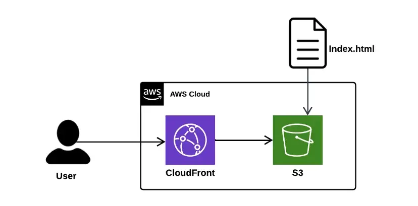

# Project 1 - Deploy Static Website on AWS

The cloud is perfect for hosting static websites that only include HTML, CSS, and JavaScript files that require no server-side processing. The whole project has two major intentions to implement:

- Hosting a static website on S3 and
- Accessing the cached website pages using CloudFront content delivery network (CDN) service. Recall that CloudFront offers low latency and high transfer speeds during website rendering

*Note* that Static website hosting essentially requires a public bucket, whereas the - CloudFront can work with public and private buckets

In this project, you will deploy a static website to AWS by performing the following steps:

- You will create a public S3 bucket and upload the website files to your bucket.
- You will configure the bucket for website hosting and secure it using IAM policies.
- You will speed up content delivery using AWS’s content distribution network service, CloudFront.
- You will access your website in a browser using the unique CloudFront endpoint.

Prerequisites:
- AWS Account
- [Student-ready starter code](https://drive.google.com/open?id=15vQ7-utH7wBJzdAX3eDmO9ls35J5_sEQ) - Download and unzip this file

Topics Covered:
- S3 bucket creation
- S3 bucket configuration
- Website distribution via CloudFront
- Access website via web browser

### Instructions

1. [Create S3 Bucket](instructions/1-create-s3-bucket.md)
2. [Upload files to S3 Bucket](instructions/2-upload-files.md)
3. [Secure Bucket via IAM](instructions/3-secure-bucket.md)
4. [Configure S3 Bucket for Static Site Hosting](instructions/4-configure-bucket.md)
5. [Distribute Website via CloudFront](instructions/5-distribute-website-w-cloudfront.md)
6. [Access Website in Web Browser](instructions/6-access-website.md)
7. [Finalize Project Submission](instructions/7-finalize-submission.md)

### Project Submission

For your submission, please submit the following:

- First, you will create an S3 bucket, configure the bucket for website hosting, and secure it using IAM policies

- Next, you will upload the website files to your bucket and speed up content delivery using AWS’s content distribution network service, CloudFront

- Lastly, you will access your website in a browser using the unique S3 endpoint

- You should take a screenshot the results of each of your steps and submit the screenshots in a zipped folder when you are done

- The zipped folder should contain a `README.txt` file which includes your **website's URL** and any other relevant info you'd like to send to the review team
